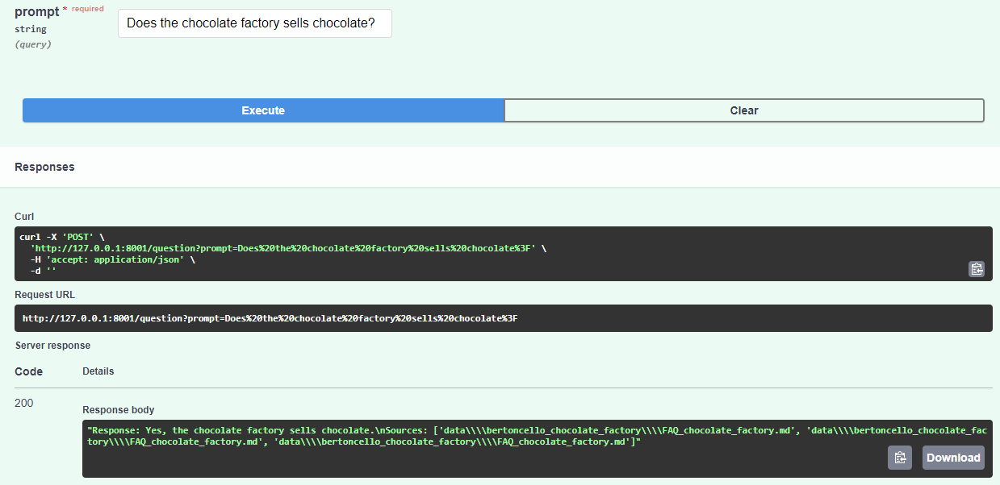

# Bertoncello's Chocolate Factory Rag Project Documentation

## Introduction

This documentation outlines the setup and functionality of a Rag project focused on processing and analyzing documents related to Bertoncello's Chocolate Factory. 

Bertoncello's Chocolate Factory is renowned for its exquisite chocolate production and unique chocolate varieties. The FAQ Chatbot API is designed to assist customers, researchers, and visitors by providing quick and accurate answers to their questions, drawing from a curated knowledge base stored in the Chroma DB.

The API's backend architecture is built using FastAPI for efficient request handling, with Langchain extensions for seamless integration of advanced language models and database operations. The Chroma DB serves as the central repository of knowledge, storing detailed descriptions of Bertoncello's Chocolate Factory. The RAG architecture, augmented with OpenAI Embeddings and Chat Models, allows for dynamic question answering by retrieving relevant context from the Chroma DB before generating responses.

## Installation

### Prerequisites

- Python 3.8 or newer
- pip package manager (can be conda as well)
- ensure openai api key is in ambient variables

### Steps

1. Clone the project repository from GitHub.
2. Navigate to the project directory.
3. Install the required Python packages using the provided `requirements.txt` file:

    ```bash
    pip install -r requirements.txt
    ```
4. Use command:
    ```bash
     uvicorn main:app --host 0.0.0.0 --port 8001
     ```
    inside `app\api` to initiate fast api server
5. Can be accessible through postman/insomnia, but use fast API documentation to test. go to browser and type http://127.0.0.1:8001/docs#/default/rag_prompt_question_post
6. Test out prompts on the endpoint `default/rag_prompt_question_post`
7. Example on fast api automatic documentation: 
8. You may create your own texts for the RAG architecture utilyzing the `support_scripts` directory, it contains scripts that create the chroma db from a .md file. You may use this fastAPI architecture to solve your specific problems.
